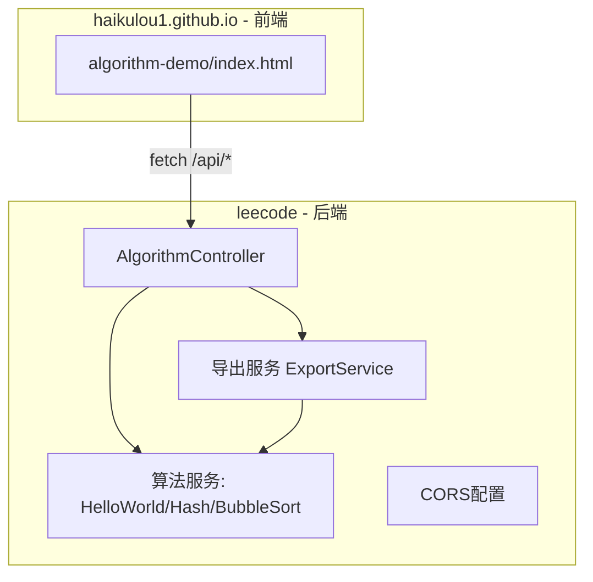
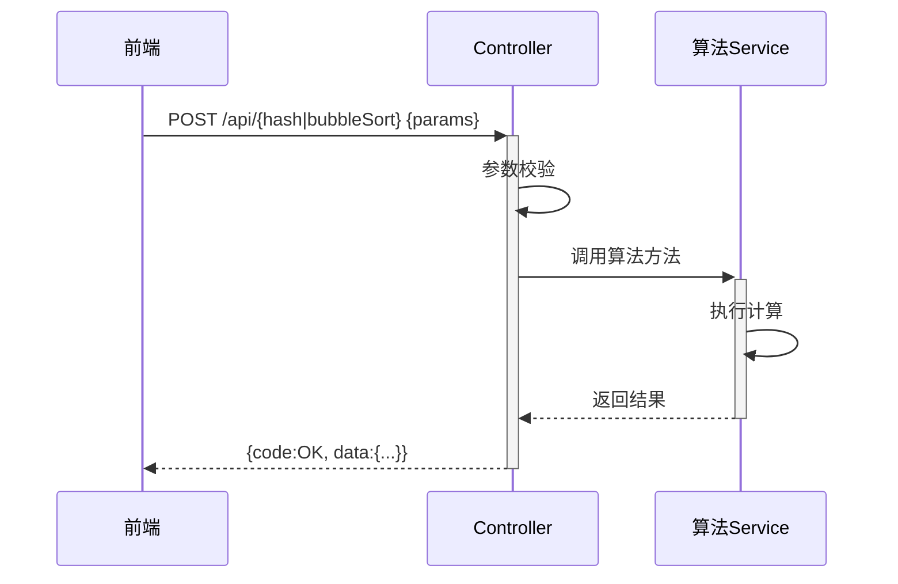
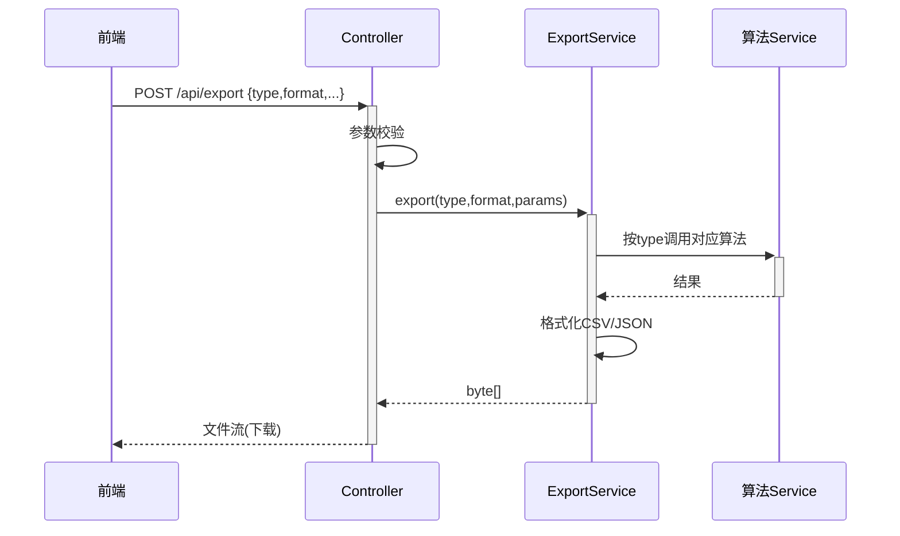
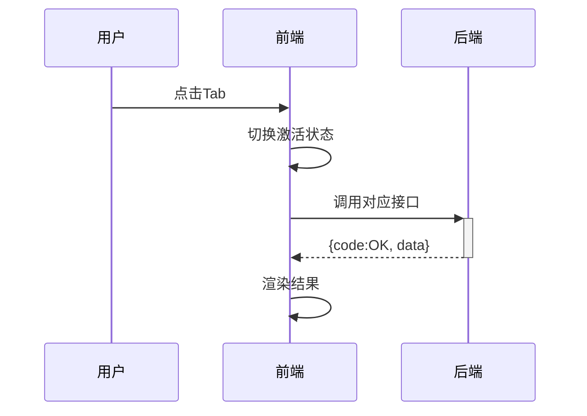

> **文档元信息**
>
> | 项目 | 内容 |
> |------|------|
> | 文档版本 | v1.1 |
> | 作者 | DTCoder |
> | 创建日期 | 2026-07-30 |
> | 需求来源 | 用java分别写三个接口helloworld、哈希算法以及冒泡排序；前端新增一个页面，有三个tab分别展示不同的执行结果；新增导出按钮，后台提供导出接口，支持导出各个页面的展示结果 |
> | 评审状态 | 待评审 |
> | 变更说明 | v1.1：增加兜底逻辑章节；精简冗余表述 |

# 新增Java接口与前端展示导出功能 系分设计

## 1. 需求与范围

- **背景与目标**：前后端联动的算法演示功能。后端 Java 实现三个接口（HelloWorld、哈希、冒泡排序），前端三 Tab 展示结果，导出按钮调后端导出接口下载文件。
- **约束**：Spring Boot + RESTful JSON；静态前端页面（fetch 跨域调用）；响应 < 500ms；导出默认 CSV，支持 JSON。
- **排除范围**：无认证鉴权、无数据库持久化、无中间件。

### 需求功能清单

| 编号 | 功能点 | 优先级 | 备注 |
|------|--------|--------|------|
| F01 | HelloWorld 接口 | P0 | 返回固定问候字符串 |
| F02 | 哈希算法接口 | P0 | 支持 MD5/SHA-256，入参为字符串 |
| F03 | 冒泡排序接口 | P0 | 入参为整型数组，返回排序结果 |
| F04 | 前端三 Tab 展示页面 | P0 | Tab 切换调用对应接口 |
| F05 | 导出按钮 + 后台导出接口 | P0 | 按 Tab 类型导出结果文件 |

### 假设与待确认项

| 编号 | 内容 | 当前假设 | 确认状态 |
|------|------|----------|----------|
| A01 | 后端框架 | Spring Boot，leecode 新增 web-demo 模块，JDK 8+ | 待确认 |
| A02 | 哈希算法 | 默认 SHA-256，可选 MD5 | 待确认 |
| A03 | 排序方向 | 默认 ASC，可选 DESC | 待确认 |
| A04 | 导出格式 | 默认 CSV，可选 JSON | 待确认 |
| A05 | 前端部署 | haikulou1.github.io 仓库 `algorithm-demo/index.html`，fetch 跨域（需后端 CORS） | 待确认 |

## 2. 架构与模块

### 功能架构


**模块清单**

| 模块 | 职责 | 依赖 |
|------|------|------|
| 算法模块 | HelloWorld、哈希计算、冒泡排序三个核心服务 | 纯 JDK |
| 导出模块 | 复用算法服务，格式化为 CSV/JSON 文件流 | 算法模块 |
| Web 模块 | REST Controller、参数校验、统一响应、CORS | 算法+导出模块 |
| 前端模块 | HTML 页面、Tab 切换、接口调用、导出交互 | 后端 Web 模块（HTTP） |

### 部署说明
- Nginx 反向代理：`/api/*` → Spring Boot（端口 8080），`/algorithm-demo/*` → 前端静态文件。
- Spring Boot 单实例（可水平扩展），无状态计算。

## 3. 数据模型与存储

**无数据库持久化**。所有接口无状态，入参实时计算返回。以下为运行时 DTO：

| DTO | 说明 | 关键字段 |
|-----|------|----------|
| HashRequest | 哈希入参 | input(String), algorithm(String) |
| BubbleSortRequest | 排序入参 | numbers(int[]), order(String) |
| ExportRequest | 导出入参 | type(String), format(String), +算法参数 |

### 枚举定义

| 枚举 | 取值 | 默认值 |
|------|------|--------|
| HashAlgorithm | MD5, SHA_256 | SHA_256 |
| SortOrder | ASC, DESC | ASC |
| ExportType | HELLO_WORLD, HASH, BUBBLE_SORT | - |
| ExportFormat | CSV, JSON | CSV |

## 4. 接口设计

### 4.1 REST 接口列表

| 编号 | 名称 | 方法 | 路径 | 入参 | 出参 data |
|------|------|------|------|------|-----------|
| W01 | HelloWorld | GET | /api/helloworld | 无 | {message:"Hello World"} |
| W02 | 哈希计算 | POST | /api/hash | input, algorithm | {input, algorithm, hashValue} |
| W03 | 冒泡排序 | POST | /api/bubbleSort | numbers, order | {input, sorted, order} |
| W04 | 结果导出 | POST | /api/export | type, format, +算法参数 | 文件流(CSV/JSON) |

### 4.2 统一响应结构

```json
{ "code": "OK|ERROR", "msg": "SUCCESS|错误信息", "data": {} }
```

### 4.3 错误码

| 错误码 | 说明 |
|--------|------|
| ALGORITHM_001 | 不支持的哈希算法 |
| ALGORITHM_002 | 哈希输入为空 |
| SORT_001 | 排序数组为空 |
| SORT_002 | 不支持的排序方向 |
| EXPORT_001 | 不支持的导出类型 |
| EXPORT_002 | 不支持的导出格式 |
| EXPORT_003 | 哈希导出缺少输入 |
| EXPORT_004 | 排序导出缺少数组 |

## 5. 功能模块设计

### 5.1 接口详细定义

#### W01 HelloWorld
- **URI**: GET /api/helloworld
- **入参**: 无
- **出参**: `data.message = "Hello World"`
- **业务规则**: 无入参校验，直接返回固定字符串。

#### W02 哈希计算
- **URI**: POST /api/hash
- **入参**: input(String,必填), algorithm(String,可选,默认SHA_256)
- **出参**: `data.{input, algorithm, hashValue(hex)}`
- **业务规则**:
  - R01: input 空白 → ALGORITHM_002
  - R02: algorithm 空 → 默认 SHA_256
  - R03: algorithm 非法 → ALGORITHM_001
- **请求示例**: `{"input":"hello world","algorithm":"SHA_256"}`
- **响应示例**: `{"code":"OK","msg":"SUCCESS","data":{"input":"hello world","algorithm":"SHA_256","hashValue":"b94d27b..."}}`

#### W03 冒泡排序
- **URI**: POST /api/bubbleSort
- **入参**: numbers(int[],必填), order(String,可选,默认ASC)
- **出参**: `data.{input, sorted, order}`
- **业务规则**:
  - R01: numbers null/空 → SORT_001
  - R02: order 空 → 默认 ASC
  - R03: order 非法 → SORT_002
  - R04: 先 clone 再排序，不修改原始入参
- **请求示例**: `{"numbers":[5,2,8,1,9,3],"order":"ASC"}`
- **响应示例**: `{"code":"OK","msg":"SUCCESS","data":{"input":[5,2,8,1,9,3],"sorted":[1,2,3,5,8,9],"order":"ASC"}}`

#### W04 结果导出
- **URI**: POST /api/export
- **入参**: type(String,必填), format(String,可选,默认CSV), hashInput/hashAlgorithm(type=HASH时), sortNumbers/sortOrder(type=BUBBLE_SORT时)
- **出参**: 文件流，`Content-Disposition: attachment; filename="{type}_result.{ext}"`
- **CSV 示例**(BUBBLE_SORT):
```
field,value
input,"5,2,8,1,9,3"
sorted,"1,2,3,5,8,9"
order,ASC
```
- **业务规则**:
  - R01: type 非法 → EXPORT_001
  - R02: format 非法 → EXPORT_002
  - R03: type=HASH 缺 hashInput → EXPORT_003
  - R04: type=BUBBLE_SORT 缺 sortNumbers → EXPORT_004
  - R05: 复用算法服务，不重复实现算法逻辑

### 5.2 子功能时序设计

#### 5.2.1 算法接口执行时序（F01-F03）


#### 5.2.2 导出执行时序（F05）


#### 5.2.3 前端 Tab 切换时序（F04）


### 5.3 前端页面设计

**文件**: [haikulou1.github.io] `algorithm-demo/index.html`

- **Tab 1 HelloWorld**: 切换时自动 GET /api/helloworld，展示 message
- **Tab 2 哈希算法**: 输入框 + 算法下拉(MD5/SHA_256)，点击"计算"调 POST /api/hash，展示 hashValue
- **Tab 3 冒泡排序**: 数组输入框(逗号分隔) + 方向选择(ASC/DESC)，点击"排序"调 POST /api/bubbleSort，展示 sorted
- **导出按钮**: 获取当前 Tab 类型及参数 → POST /api/export → Blob + a 标签触发下载
- **接口地址**: 页面常量 `const API_BASE = 'http://localhost:8080'`，需后端 CORS

## 6. 兜底逻辑（新增）

本章节集中描述各层兜底/降级策略，确保异常场景下系统仍可用。

### 6.1 后端兜底

| 场景 | 兜底策略 | 触发条件 |
|------|----------|----------|
| HelloWorld 服务异常 | 返回固定值 `{"code":"OK","data":{"message":"Hello World"}}` | Service 抛出任意异常 |
| 哈希 MessageDigest 异常 | 自动降级为 SHA-256 重试一次；仍失败则返回 hashValue="" + code="OK" | NoSuchAlgorithmException |
| 哈希 input 为空 | 返回 ALGORITHM_002 错误码，不崩溃 | input null/blank |
| 排序数组过大(>1000) | 截取前 1000 元素排序，data 中追加 `truncated:true` 标记 | numbers.length > 1000 |
| 排序方向非法 | 降级为 ASC 继续排序，data.order 标注实际值 | order 非 ASC/DESC |
| 导出算法服务异常 | 返回仅含表头的空 CSV（`field,value\n`）或空 JSON `{}`，code="OK"，msg 标注"兜底导出" | 算法 Service 抛异常 |
| 导出格式非法 | 降级为 CSV 格式输出 | format 非 CSV/JSON |
| 框架级未知异常 | 全局异常处理器捕获，返回 `{"code":"ERROR","msg":"服务异常，请稍后重试","data":null}`，HTTP 200 | 任意未捕获异常 |

**兜底原则**：
- 优先返回有效数据（哪怕是默认值），而非直接报错。
- 兜底降级时在 msg 或 data 中标注降级标记，便于排查。
- 导出接口兜底不返回错误 JSON，而是返回可下载的最小文件，确保前端下载流程不中断。

### 6.2 前端兜底

| 场景 | 兜底策略 | 触发条件 |
|------|----------|----------|
| 接口请求超时(>10s) | 展示"请求超时，请检查后端服务" + 重试按钮 | fetch 超时 |
| 后端服务未启动 | 展示"无法连接后端服务，请确认服务已启动" | fetch 网络错误 |
| 接口返回 code != OK | 展示 msg 错误信息，不渲染空数据 | response.code === "ERROR" |
| 哈希结果为空(兜底值) | 展示"哈希计算异常，已返回兜底结果" + 显示空值 | hashValue === "" |
| 排序结果含 truncated 标记 | 展示"数组过大，已截取前 1000 元素排序" | data.truncated === true |
| 导出接口失败 | 提示"导出失败，请重试" + 保持页面可用 | 导出 fetch 异常 |
| 导出返回非文件流 | 尝试解析 JSON 展示错误信息；解析失败提示"导出异常" | response Content-Type 非 octet-stream |

**前端兜底原则**：
- 任何接口异常不影响页面其他 Tab 功能。
- 导出失败不影响已展示的结果内容。
- 兜底展示明确告知用户"降级/兜底"状态，不静默吞错。

## 7. 非功能性需求

### 7.1 高可用
单实例演示部署，服务异常时前端兜底提示。无外部依赖，无需降级链路。

### 7.2 可扩展
后端无状态可水平扩展；前端静态文件可 CDN 分发。

### 7.3 稳定性
冒泡排序建议数组长度 < 1000（超过兜底截断）；哈希使用 JDK MessageDigest。边界输入由参数校验 + 兜底逻辑双重保障。

### 7.4 安全性
- 认证/授权：演示场景不涉及，公开接口。
- 数据防护：无持久化，无敏感数据。生产化后建议增加登录拦截器。
- 输入校验：后端参数校验 + 前端校验双重防护，防止恶意输入。

### 7.5 监控
后端接口日志记录请求参数/耗时/异常；前端 console.error 记录调用异常。生产化后建议错误率 > 5% 告警。

## 8. 变更三板斧

- **可监控**：Spring Boot Actuator 健康检查 + 指标；接口调用量/响应时间/错误率。
- **可灰度**：演示场景不涉及；生产化可通过 API 网关按流量灰度。
- **可应急**：接口异常通过兜底逻辑返回默认值；后端可配置开关强制返回兜底结果；回滚无数据兼容风险（无状态新增功能）。
